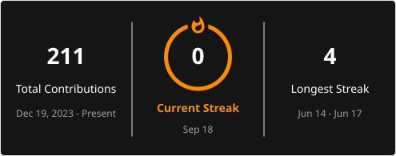

  

  
  
  
  
  
  
  
  

I'm an **AI & Automation Engineer** from Pakistan, focused on building production-grade generative AI systems, OCR/computer-vision pipelines, and business automation workflows. I hold a BS in Artificial Intelligence and have hands-on experience integrating LLMs and CV models into real-world products that clients actually run in production.

I work across the full stack — from prompt/system-prompt design, to OCR and RAG pipelines, to REST API backends and n8n automations that wire everything together.

---

## 💼 What I Do

- 📄 **Document Intelligence / OCR pipelines**: high-throughput extraction from scanned business documents using PaddleOCR + OpenVINO acceleration
- 🤖 **LLM-powered chatbot development** with multi-turn memory, intent recognition, and contextual reasoning
- 🔍 **RAG / retrieval pipeline** design and deployment
- ⚡ **Business process automation** with n8n, connecting LLMs to APIs, databases, and webhooks
- ✍️ **Prompt & system-prompt engineering** for real-world production use cases
- 👁️ **Computer vision**: real-time object detection, OCR-based text reading, gesture/plate recognition
- 🧠 **ML/DL for NLP & audio**: intent recognition, NER, text classification, sentiment & speech-emotion analysis

---

## 🛠️ Tech Stack

**AI & LLMs:** OpenAI (GPT-4 / GPT-3.5), Anthropic (Claude), Google (Gemini), Hugging Face Transformers
**OCR & Computer Vision:** PaddleOCR, OpenVINO, OpenCV, YOLOv8
**Automation:** n8n, LLM-to-API/database wiring, REST APIs, webhooks, third-party integrations
**Languages & Backend:** Python, SQL, FastAPI, Flask
**ML / DL & NLP:** TensorFlow, Scikit-learn, Keras, Pandas, NumPy · CNN, RNN, LSTM, Transformer, ViT
**Tools:** Git, GitHub, Docker (basic), Postman, VS Code
**Integrations:** Stripe, QuickBooks Online, Google APIs, SMTP/Mail services

---

## 🚀 Selected Projects

> 🔒 Most client/production repos are private. Descriptions reflect live, deployed work.

### 📄 HaeirLens OCR Based Data Exctraction — Intelligent Document Processing Pipeline
Production OCR pipeline for Haier Pakistan Delivery Notes & Gate Passes, extracting Customer No, DN No, model codes, serial numbers, and item numbers.
- Rearchitected from a job-queue/SQLite/dashboard model into a single synchronous `POST /extract → immediate result` FastAPI endpoint
- ~0.26s/region throughput using PaddleOCR PP-OCRv6_tiny + OpenVINO HPI acceleration, with parallel page processing via ThreadPoolExecutor
- Custom table-boundary detection, anchor-based row grouping, continuation-page numbering, and handwritten-stamp noise suppression

---

### 💱 Cross-System Reconciliation Automation (n8n + Python)
Scheduled automation pipeline pulling data from Stripe and QuickBooks Online via their APIs, matching transactions and surfacing only discrepancies — replacing a manual multi-hour reconciliation process with a hands-off daily run used by a real client.
- Built on n8n, integrating QuickBooks Online and Claude AI
- Drastically reduced manual processing time per reconciliation cycle
- Deployed in production; exceptions-only reporting surfaces what matters

---

### 🎙️ [NeuraSense — Speech Emotion Recognition](https://github.com/HaroonRasheed-ui/NeuraSense-Speech-Emotion-Recognition-System)
Deep learning system recognizing human emotion from speech in real time.
- CNN + Bidirectional LSTM + Multi-Head Attention architecture
- Real-time inference pipeline for continuous audio streams

---

### 👓 [AI Smart Glasses for the Visually Impaired](https://github.com/HaroonRasheed-ui/AI-Smart-Glasses-Visually-Impaired-People)
Assistive wearable with real-time YOLOv8 obstacle detection and spatial audio guidance (English/Urdu), plus OCR-based text reading.
- Edge-deployable pipeline with optional Arduino/GPS hardware integration
- OCR + TTS pipeline for intuitive, voice-based alerts

---

### 🗣️ Hamer AI Assistant — Assistive Voice Conversational AI
Multi-modal (voice + text) AI assistant with real-time LLM responses, multi-turn memory, and tool-use/contextual reasoning for complex, multi-step queries.
- Built with Python, LangChain, and OpenAI APIs
- ReAct-style agentic pipeline for autonomous multi-step reasoning

---

## 📌 Current Focus

- 📄 Production OCR/IDP pipelines and document-intelligence throughput optimization
- 🧠 Advanced LLM agent design and multi-agent orchestration
- 🔍 Production RAG pipelines and retrieval optimization
- 🏢 Enterprise AI automation and business workflow integration (ERP/HRMS-adjacent)

---

## 🎓 Education & Certifications

**BS in Artificial Intelligence** — The University of Haripur, KPK, Pakistan (2021 – 2025)

- Data Science & AI Internship — CodXo (2024)
- AI Engineering Internship — EcodeCamp (2024)
- Data Analytics Externship — Beats by Dre (2024)

---

## 📊 GitHub Activity

  

  
  

  

### 🏆 Trophies

  

### 🐍 Contribution Snake

  

> ⚠️ The snake animation only renders once the GitHub Action in `snake.yml` (included alongside this file) has run at least once on your profile repo — see setup notes below.

---

## 📬 Connect With Me

- 📧 Email: [haroon5253rasheed@gmail.com](mailto:haroon5253rasheed@gmail.com)
- 💼 LinkedIn: [Haroon Rasheed](https://www.linkedin.com/in/haroon-rasheed-383768375)
- 📞 WhatsApp: [+92 324-0829682](https://wa.me/923240829682)
- 📍 Charsadda, KPK, Pakistan · **Open to Remote**

  

